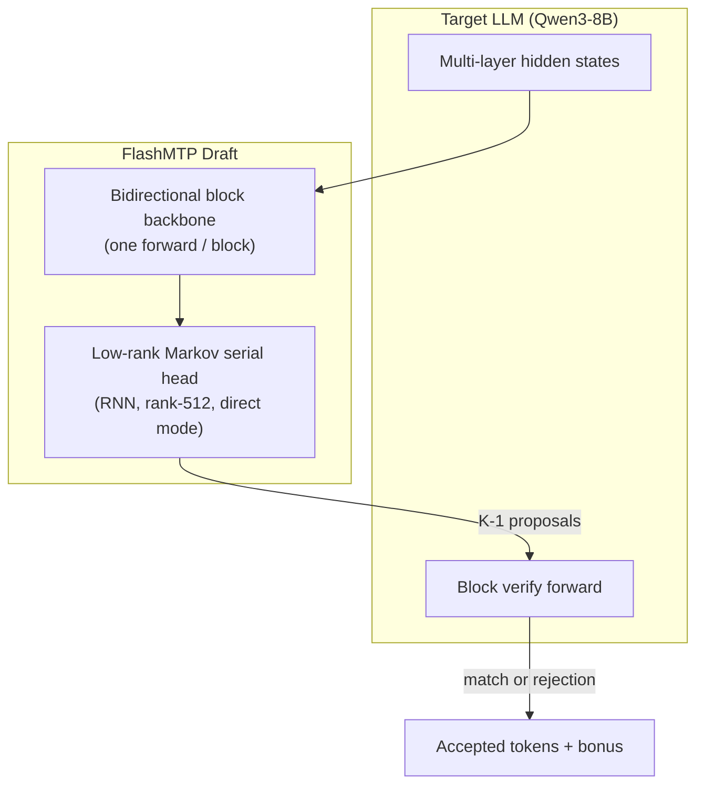

# FlashMTP v2: ICLR Submission Package

> **Working title:** *FlashMTP: Parallel Block Drafting with Low-Rank Markov Heads for Fast and Correct Stochastic Speculative Decoding*  
> **Status:** Internal research draft — numbers from logs dated 2026-07-30  
> **Artifacts:** `benchmark_results/SUMMARY.md`, `docs/STOCHASTIC_VERIFICATION.md`, `profile/compile_serial_head_profile.md`

---

## Abstract (draft)

Large language model inference remains bottlenecked by autoregressive decoding. Recent speculative methods accelerate generation by drafting multiple tokens per target forward pass, but parallel block drafters face a fundamental tension: they propose tokens from a block-conditional distribution, while verification must respect the target's stochastic policy at non-zero temperature. We present **FlashMTP v2**, which combines (1) a **parallel bidirectional draft backbone** conditioned on multi-layer target hidden states, (2) a **low-rank Markov serial head** that restores within-block autoregressive dependencies with minimal overhead, and (3) a **proper rejection-sampling verifier** for temperature-$T$ decoding. On Qwen3-8B across eight benchmarks, our best checkpoint achieves **3.77×** token-weighted speedup on Math500 and **2.43×** macro-average speedup at greedy decoding ($T{=}0$). We show that naive token-match verification at $T{=}1$ underestimates acceptance by up to **12%** on GSM8K; switching to rejection sampling with stochastic drafts recovers **3.58×** vs **3.20×** speedup. A targeted `torch.compile` of the serial head yields an additional **5–11%** end-to-end gain, explained by micro-profiling (serial head = 9% of step time, 1.85× kernel speedup). FlashMTP matches or exceeds DFlash on long-context tasks while offering a principled stochastic verification path absent in prior parallel-block systems.

---

## 1. Problem statement

**Autoregressive bottleneck.** Each token requires a full target forward pass. Speculative decoding amortizes this by proposing $K$ tokens and verifying them in one batched target step.

**Parallel block drafting gap.** Methods like DFlash draft an entire block in one bidirectional forward pass — high GPU utilization, but block proposals are not standard left-to-right conditionals. Prior work largely evaluates at $T{=}0$ or uses **token-match verification** at $T{>}0$, which:

- Drafts greedily while the target samples stochastically.
- Does not implement $\min(1, p/q)$ rejection sampling.
- Systematically reduces acceptance length and throughput.

**Our goal.** Maintain parallel block efficiency while (a) modeling within-block AR structure via a lightweight Markov head, and (b) providing **distribution-aware stochastic verification** compatible with DistSpec/DSpARK theory.

---

## 2. Method

### 2.1 Architecture overview



**Key design choices (vs DFlash):**

- Condition on **all target layers'** pivot hidden states (not just final layer).
- **Markov serial head** decouples token-chain memory from per-position parallel hidden (see `compare.md` vs DSpARK).
- **`direct` output mode:** serial head produces logits directly, skipping base LM head at draft time.

### 2.2 Verification modes

| Mode | Draft $T$ | Verify | Distribution-correct? |
|------|:---------:|--------|:---------------------:|
| `match` | 0 (greedy) | token equality vs target sample | No at $T{>}0$ |
| `rejection` | $T$ | $\min(1,p/q)$ + residual | Yes (w.r.t. block proposal) |

See `docs/STOCHASTIC_VERIFICATION.md` for full math and code pointers.

### 2.3 `compile_serial_head`

`torch.compile` on `markov_head.sample_block_tokens` only. Measured: **1.85×** serial-head speedup, **1.04×** per-step, **1.05–1.11×** e2e on math/code tasks. See `profile/compile_serial_head_profile.md`.

---

## 3. Contributions

1. **Low-rank Markov serial head for parallel block drafting.** A parameter-efficient RNN head ($R{=}512$, direct mode) restores within-block AR dependencies on top of a single bidirectional draft forward, achieving **4.94–5.06** mean accept length on GSM8K/Math500 at $T{=}0$ (vs **1.9–2.0** on MT-Bench).

2. **Principled stochastic verification for parallel blocks.** We implement and evaluate speculative rejection sampling (`rejection_sample_verify`), showing **+8–13% speedup** over token-match at $T{=}1$ on structured tasks (GSM8K: 3.58× vs 3.20×).

3. **Training recipe ablation.** Three checkpoints (CE/TV/Base-LM-CE weights) on Qwen3-8B; Model B (`ce0.1_tv1.0_base0.0`) wins on macro speedup: **2.43×** at $T{=}0$, **+1.1%** over next-best across 48 settings.

4. **Systems profiling and compile optimization.** Micro-benchmarks decompose the spec step (81% target verify, 9% serial head) and validate that `compile_serial_head` improves e2e by the amount predicted from Amdahl's law.

---

## 4. Experimental setup

| Setting | Value |
|---------|-------|
| Target | Qwen3-8B |
| Draft | RNN Markov head, rank 512, direct, block 16 |
| Benchmarks | Alpaca, GSM8K, MBPP, AIME25, Math500, MT-Bench, LongBench-v2 (MDQA, ICL) |
| Samples | 50 per dataset (30 AIME, 33 MDQA, 6 ICL, 18 MT-Bench turns) |
| Hardware | 8 × NVIDIA H800 |
| Metric | Token-weighted decode speedup (CUDA wall after prefill) |

**Runs:**

- `three_model_speedup_20260730_1505/` — 3 checkpoints × 2 temps × 8 datasets = 48 jobs (**complete**)
- `compile_rejection_20260730_1834/` — compile + rejection ablation = 24 jobs (**21 complete**, 3 SIGTERM failures)

---

## 5. Key results

### 5.1 Greedy decoding ($T{=}0$) — Model B

| Dataset | Speedup | Accept length |
|---------|--------:|--------------:|
| Math500 | **3.77×** | 5.06 |
| GSM8K | **3.68×** | 4.94 |
| MBPP | 2.93× | 3.97 |
| AIME25 | 2.99× | 4.03 |
| Alpaca | 1.83× | 2.45 |
| MT-Bench | 1.53× | 2.04 |
| LongBench MDQA | 1.26× | 2.12 |
| LongBench ICL | 1.42× | 2.35 |
| **Macro mean** | **2.43×** | 3.25 |

With `compile_serial_head`: GSM8K **3.94×**, Math500 **4.01×**.

### 5.2 Stochastic decoding ($T{=}1$) — rejection vs match

| Dataset | Match speedup | Rejection speedup | Δ |
|---------|-------------:|------------------:|--:|
| GSM8K | 3.20× | **3.58×** | +12% |
| Math500 | 3.22× | **3.48×** | +8% |
| AIME25 | 2.46× | **2.79×** | +13% |
| MBPP | 2.68× | **2.94×** | +10% |

Accept length increases by **+0.2–0.3** tokens/step on average.

### 5.3 Three-model ablation (macro mean speedup)

| Model | $T{=}0$ | $T{=}1$ |
|-------|--------:|--------:|
| A (tv0.9, base0.2) | 2.39× | 2.12× |
| **B (tv1.0, base0.0)** | **2.43×** | **2.13×** |
| C (legacy) | 2.36× | 2.10× |

TV loss (token-level verification alignment) provides a small but consistent gain, especially at $T{=}0$.

---

## 6. Comparison with prior art

### vs DFlash

| Aspect | DFlash | FlashMTP v2 |
|--------|--------|-------------|
| Conditioning | Target hidden (typically final layer) | **All-layer** pivot hiddens |
| Within-block AR | Implicit in block model | **Explicit Markov serial head** |
| Stochastic verify | Not standard | **`rejection` mode** |
| LongBench (v1.3 server bench) | 1.94× mean | **2.61× mean** |

### vs Eagle3 / Medusa

Eagle uses autoregressive draft trees with learned features; high acceptance but serial draft growth. FlashMTP drafts **entire blocks in one parallel forward** — better for wide blocks on modern GPUs, with accept length competitive on math/code.

### vs DSpARK / DistSpec

Shares rejection-sampling theory. FlashMTP's Markov head **decouples token memory from parallel hidden** (state update uses only $[s_{k-1}; e_{k-1}]$, not $h_k$), enabling direct-mode logits without base LM head at inference. See `compare.md`.

---

## 7. Limitations

1. **Long-context weakness.** LongBench MDQA achieves only **1.26×** at $T{=}0$; acceptance ~2.1 tokens/step. Likely due to distribution shift at 64k context and block-conditional approximation.

2. **Block-conditional distribution.** Parallel bidirectional drafting does not match true AR conditionals; rejection sampling is correct w.r.t. the proposal, not bitwise AR equivalence.

3. **Rejection mode constraints.** Batch size 1 only; no CUDA-graph path yet.

4. **Incomplete ablation jobs.** Three `compile_rejection` tasks failed (mt-bench rejection, easy-model mt-bench + mdqa).

5. **Single target model.** Results on Qwen3-8B only; generalization to MoE / larger models untested.

---

## 8. Future work

- [ ] Complete failed benchmark jobs; add LiveCodeBench and HumanEval.
- [ ] Batch rejection sampling (extend beyond bsz=1).
- [ ] Fused target verify kernel / smaller verify blocks for long context.
- [ ] Multi-target evaluation (Llama-3, Qwen3-32B).
- [ ] Formal distribution analysis: block-conditional vs AR KL divergence.
- [ ] Integration with SGLang/vLLM serving stack.

---

## 9. Reproducibility

```bash
cd /share/dai-sys/wanghanzhen/projects/MTP/FlashMTP_v2
source .venv/bin/activate

# Full three-model sweep
bash scripts/run_three_model_speedup_benchmarks.sh

# Compile + rejection ablation
bash scripts/run_compile_rejection_benchmarks.sh

# Parse all logs
python scripts/summarize_benchmarks.py --per-run

# Profile compile_serial_head (idle GPU)
CUDA_VISIBLE_DEVICES=0 python profile/profile_compile_serial_head.py
```

**Checkpoint (Model B):**  
`cache/models/flashmtp_v2_mhrnn_direct_r512_ce0.1_tv1.0_wb_0.0_bgemma_21_qwen3_8b`

---

## 10. Suggested citation

```bibtex
@article{flashmtp2026,
  title={FlashMTP: Parallel Block Drafting with Low-Rank Markov Heads
         for Fast and Correct Stochastic Speculative Decoding},
  author={...},
  year={2026},
  note={Code: FlashMTP\_v2}
}
```

---

## Appendix: File index

| File | Purpose |
|------|---------|
| `ICLR_SUBMISSION_PACKAGE.md` | This document |
| `benchmark_results/SUMMARY.md` | Unified results tables |
| `docs/STOCHASTIC_VERIFICATION.md` | Match vs rejection deep-dive |
| `profile/compile_serial_head_profile.md` | Latency breakdown + theory |
| `compare.md` | vs DSpARK Markov head |
| `scripts/summarize_benchmarks.py` | Log → CSV/JSON parser |
| `README.md` | Project overview + quick start |
