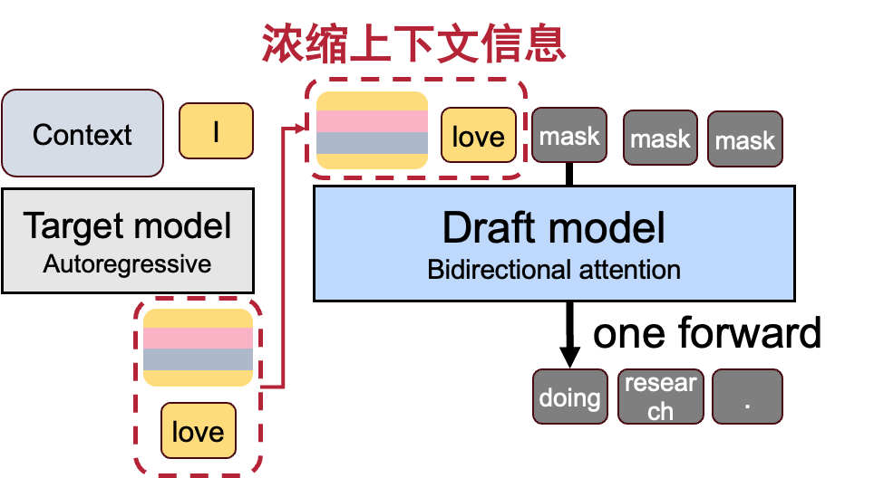
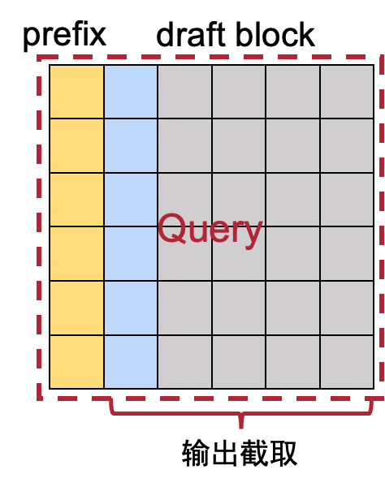

# FlashMTP

## Ours core idea

Since the hidden states are calculated by the model from its complete context, therefore they are the concentration of the context.
When predicting the following block tokens, we only need the latest hidden states.
We propose FlashMTP, which utilize the last hidden states (limited context) and bidirectional attention (diffusion-based) to make draft token generation like a flash in MTP/SD

## Base structure

Like DFlash. But we use all bonus hidden states of all layers. Cuz when generating the hidden states, all layer focus on different part of context as the attention patern of every head across layers differ a lot. We concat them along feature dim (seq dim fails) and use it as condition. Then we concat bonus clean token and several mask(noise) and forward only once. Noise block serves as Q, concat sequence serves as kv.  Every layer's kv is the same.



## v1.1 Improved condition injection

* To improve model expression and condition info, we input the whole concat seq into the model as Q. Therefore, the prefix can be processed across layers and every layer can have different prefix.
* We buiding the prefix hidden states, we include the initial embedding to let the model know the begining point.
*



## v2: Improved structure

The basic version has a drawback. There are always repetative in adjacent positions or meaningless tokens like ("the", "," ...) in the last. This rises from the harlearning goal of the one-forward prediction paradigm. We'd like to utilize diffusion method. Continuous diffusion and disill it.

Besides, the later the posiion of tokens, the less info i can get from the condition. Inspired by sse, maybe we can enhance condition by concating it with every mask(noise).

## v3: Diffusion-based draft model

### 1. previous version

Actually, the structure isn't based on diffusion. During training, the mask token are directly mapped to clean tokens in one forward.

### 2. Consistency distillation

base on base structure

### 1. 模型原理（Model Principle）

本方案将**每次 draft 的 B 个 token** 视为一个独立的短序列（长度 L = 16），并将 Inner block size 设置为 B_in = 1。

- **核心思想**：模型在一次前向传播中，只负责预测当前连续的 16 个 token，不预测后续内容。下一次预测属于新的独立 forward。
- **Teacher**：原始自回归模型，用于生成高质量轨迹。
- **Student**：我们要训练的 draft 模型。输入条件是大模型bonus token之前的融合hiddenstates。bonustoken拼接上noiseembedding作为Query
- **训练目标**：让学生模型从任意中间状态 y，稳定地一次性预测出高质量的 16 个 token（即实现可靠的 multi-token draft）。

通过将 B=16 视为完整序列、B_in=1 视为最小块，模型可以同时利用：

- Distillation Loss：学习 Teacher 的正确预测
- Consistency Loss：学会从“部分完成”到“全部完成”的稳定跳跃

这样训练出的模型适合作为投机解码（Speculative Decoding）的 draft 模型，一次 forward 即可输出 16 个 draft token。

两个状态：

* **y**：**当前采样的解码中间状态**（部分完成的草稿）
* **y**\*：当前 innerblock token 被 unmask  后的状态。B长度内在这之后的token还是mask着的。（inner_block completion states）

### 2. 损失函数（Loss Functions）

#### 2.1 Distillation Loss（蒸馏损失，主损失）

$$
L_{\text{Distillation}} = \mathbb{E} \frac{1}{|U_y|} \sum_{i \in U_y} D_{KL} \left( p_i^{(T)} \parallel q_\phi(\cdot | y, x)_i \right)
$$

- $U_y$：当前 B=16 个位置中，从 y 到 y* 之间**新被 unmask** 的 token 位置。一次B_in个token（即1）
- $p_i^{(T)}$：Teacher 使用 hidden state 重建的 softmax 预测。
- **作用**：强制学生在看到部分 token 的情况下，预测出 Teacher 会最终选择的 16 个 token。

#### 2.2 Consistency Loss（一致性损失，关键稳定损失）

$$
L_{\text{Consistency}} = \mathbb{E} \frac{1}{|S_y|} \sum_{i \in S_y} D_{KL} \left( q_\phi^-(\cdot | y^*, x)_i \parallel q_\phi(\cdot | y, x)_i \right)
$$

- $S_y$：在 y* 中仍然保持 masked 的位置（即当前 B 个序列中尚未 final 的 token）。
- $q_\phi^-$：带 stop-gradient 的目标（防止训练不稳定）。
- **作用**：让学生在 “少信息状态 y” 和 “innerblock completion 状态 y* ” 之间保持预测一致，实现稳定跳跃。

#### 2.3 总损失函数

$$
L = w_{\text{distill}} \cdot L_{\text{Distillation}} + w_{\text{cons}} \cdot L_{\text{Consistency}}
$$

**推荐权重**（B=16, L=1）：

- $w_{\text{distill}} = 1.0$
- $w_{\text{cons}} = 0.6$


这里有一个问题，$q_\phi^-$ 需要学生模型自己来预测。但我是从零初始化，因此需要先训练一个多步迭代扩散草稿模型（纯蒸馏损失），再加入一致性损失。上面的两个权重给出调整接口。

## 3. 训练流程（Training Procedure）

### 3.1 准备阶段（Offline Trajectory Collection）

1. 使用 自回归目标模型 模型对大量 prompt 生成轨迹。（已完成）
2. 每条轨迹记录：

   - 人为构建 块内 B 内的 Token 序列轨迹 ($\mathcal{T}_x$)。按照从左到右的因果顺序。也就是说，解码轨迹模拟自回归生成的轨迹。
   - 对应 hidden state buffer（用于重建 Teacher logits）*这个在线生成

### 3.2 训练阶段（每一次迭代）

1. 基于base structure，我们已经采样了一个anchor token。那么后面的目标就是预测此锚点块的解码轨迹 $\mathcal{T}_{x}$。
2. **随机采样中间状态 y**：
   - 在轨迹中随机选择步骤 k。在这里，因为轨迹是因果的，因此可以直接采样一个块内位置p，其之前p个token看作已生成的轨迹，后面的都是mask。
   - $y = \mathcal{T}_x$
   - $y^* = \mathcal{T}_x'$ 即当前B_in中被全部unmask后的状态。这里就是第p+1个token被unmask
3. 计算两个损失（所有计算均限制在当前 B=16 个 token 范围内）：
   - Distillation Loss（在 Uy 上）
   - Consistency Loss（在 Sy 上）
4. 计算总损失并反向传播，更新学生模型参数。
5. 重复上述过程直到收敛。

### 3.3 推理阶段（Inference / Drafting）

- 输入：大模型融合hiddenstates + 当前需要 draft 的 16 个 masked 位置。
- 一次前向传播：模型直接预测当前 16 个 token。

## Use UV

> \# git clone the source code
>
> git clone https://github.com/sgl-project/SpecForge.git
>
> cd SpecForge
>
> \# create a new virtual environment
>
> uv venv -p 3.11
>
> source .venv/bin/activate
>
> \# install specforge
>
> uv pip install -v -e . --prerelease=allow
>
> uv pip install datasets==4.8.3 pyarrow==23.0.1

## 📃 Citation

```plaintext
@misc{specforge2025,
  title={SpecForge: Train speculative decoding models effortlessly},
  author={Shenggui Li, Yikai Zhu, Chao Wang, Fan Yin, Shuai Shi, Yubo Wang, Yi Zhang, Yingyi Huang, Haoshuai Zheng, Yineng Zhang},
  year={2025},
  publisher={GitHub},
  howpublished={\url{https://github.com/sgl-project/specforge}},
}
```
