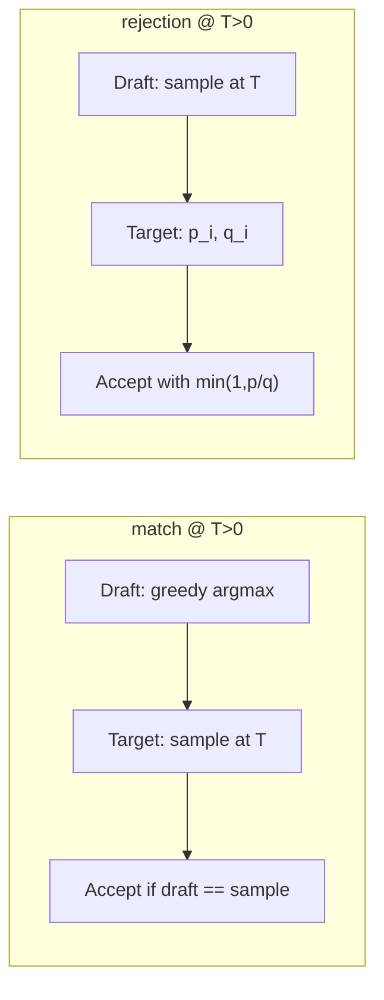

# Stochastic Verification in FlashMTP

Technical reference for `match` vs `rejection` verification modes in `spec_generate`.
Code: `specforge/modeling/draft/flashmtp.py`.

---

## Problem

Parallel block speculative decoding proposes $K{-}1$ draft tokens in one forward pass, then verifies them against the target model. At **temperature $T{=}0$** (greedy), verification reduces to prefix equality with the target's greedy continuation — exact and efficient.

At **$T{>}0$**, the target defines a **stochastic** continuation. Prior parallel-block systems (including naive FlashMTP deployments) often:

1. Sample draft tokens with **greedy** decoding ($T_\text{draft}{=}0$), and
2. Verify by checking whether draft tokens equal **independent target samples** (`match` mode).

This combination is **not** rejection sampling. It does not preserve the target distribution and systematically **underestimates acceptance length**, hurting throughput at $T{=}1$.

---

## Notation

| Symbol | Meaning |
|--------|---------|
| $q_i(y)$ | Draft model probability of token $y$ at position $i$ |
| $p_i(y)$ | Target model probability at position $i$ (after softmax at temperature $T$) |
| $\tilde{y}_i$ | Draft-proposed token at position $i$ |
| $K$ | `verify_block_size` (default 16) |
| Proposals | $\tilde{y}_1, \ldots, \tilde{y}_{K-1}$ (slot 0 is the known anchor) |

---

## Mode 1: `match` (default)

**Draft sampling:** `draft_temperature = 0` always (greedy), even when `temperature > 0`.

**Verification** (`spec_generate`, else branch):

```python
posterior = sample(output.logits, temperature)  # target samples
acceptance_length = (
    (verify_output_ids[:, 1:] == posterior[:, :-1])
    .cumprod(dim=1)
    .sum(dim=1)
)
next_token = posterior[:, acceptance_length]
```

**Semantics:** Accept the longest prefix where each draft token equals an **independent draw** from $p_i$. This is a **heuristic** that:

- Biases toward low-probability target tokens (draft is greedy, target is stochastic).
- Does **not** implement the standard speculative rejection test $\min(1, p/q)$.
- Is **not** distribution-preserving.

**When to use:** Quick benchmarking, debugging, or when exact target distribution is not required. Acceptable at $T{=}0$ (both sides deterministic).

---

## Mode 2: `rejection` (proper speculative sampling)

**Draft sampling:** `draft_temperature = temperature` — draft and target use the same $T$.

**Verification** (`rejection_sample_verify`):

For each proposed token $\tilde{y}_i$:

$$
\alpha_i = \min\!\left(1,\; \frac{p_i(\tilde{y}_i)}{q_i(\tilde{y}_i)}\right)
$$

Accept $\tilde{y}_i$ with probability $\alpha_i$, stopping at the first rejection. On rejection at position $i$, sample the correction token from the **residual distribution**:

$$
r_i(y) = \frac{\max(0,\; p_i(y) - q_i(y))}{\sum_{y'} \max(0,\; p_i(y') - q_i(y'))}
$$

If all $K{-}1$ proposals are accepted, sample the bonus token from $p_K$ directly.

This matches the sequential acceptance semantics used by **DSpARK / DistSpec** theory.

**Constraints (current implementation):**

- `temperature > 0` required.
- `batch_size == 1` only.
- Draft logits must be returned from `sample_draft_tokens` for $q_i$.

---

## Why greedy draft + match fails at $T{>}0$



Consider a position where the draft's greedy token $\hat{y} = \arg\max q$ has high $q(\hat{y})$ but moderate $p(\hat{y})$ under stochastic target. The target sample will rarely equal $\hat{y}$, so **match** accepts ~0 tokens. **Rejection** accepts with probability $p(\hat{y})/q(\hat{y})$, which can be substantial when $q$ is calibrated.

**Measured effect** (Model B, gsm8k, $T{=}1$, `compile_serial_head=true`):

| Mode | Speedup | Accept length | Draft accept rate |
|------|--------:|--------------:|------------------:|
| match | 3.20× | 4.33 | 23.5% |
| rejection | **3.58×** | **4.60** | **24.0%** |

Similar gains on math500 (+8%), aime25 (+13%), mbpp (+10%).

---

## Code map

| Function / flag | Location | Role |
|-----------------|----------|------|
| `STOCHASTIC_VERIFICATION_MODES` | `flashmtp.py:43` | `("match", "rejection")` |
| `rejection_sample_verify()` | `flashmtp.py:87` | Core rejection math |
| `spec_generate(..., stochastic_verification_mode=)` | `flashmtp.py:1064` | Main decode loop |
| `draft_temperature` branch | `flashmtp.py:1188` | Greedy vs stochastic draft |
| `--stochastic-verification-mode` | `evaluation/benchmark.py` | CLI flag |

Key branch in `spec_generate`:

```1188:1229:specforge/modeling/draft/flashmtp.py
            draft_temperature = temperature if use_rejection_sampling else 0.0
            sampled_draft_tokens, draft_logits = self.sample_draft_tokens(
                ...
                temperature=draft_temperature,
                compile_serial_head=compile_serial_head,
            )
            ...
            if use_rejection_sampling:
                acceptance_length, next_token = rejection_sample_verify(
                    proposed_tokens=verify_output_ids[:, 1:],
                    draft_logits=draft_logits[:, :proposal_count, :],
                    target_logits=output.logits,
                    temperature=temperature,
                )
            else:
                posterior = sample(output.logits, temperature)
                acceptance_lengths_per_row = (
                    (verify_output_ids[:, 1:] == posterior[:, :-1])
                    .cumprod(dim=1)
                    .sum(dim=1)
                )
                ...
```

---

## Recommendations for users

| Scenario | `temperature` | `stochastic_verification_mode` | `compile_serial_head` |
|----------|:-------------:|:------------------------------:|:---------------------:|
| Production greedy decode | 0 | `match` (default) | **true** |
| Stochastic chat / sampling | > 0 | **`rejection`** | true |
| Distribution audit / debugging | > 0 | `rejection` | either |
| Fast sanity check | any | `match` | either |

**CLI example:**

```bash
python evaluation/benchmark.py \
  --temperature 1 \
  --stochastic-verification-mode rejection \
  --compile-serial-head \
  ...
```

**Caveat:** Parallel block drafting proposes tokens from a **block-conditional** distribution (bidirectional context within the block), not the true left-to-right autoregressive $p(y_i \mid y_{<i})$. Rejection sampling guarantees correctness **relative to the block proposal distribution**, not bitwise equivalence to naive AR sampling. For exact AR equivalence, use standard autoregressive speculative decoding (Eagle, Medusa) or accept the block approximation.

---

## Related reading

- `compare.md` — FlashMTP vs DSpARK Markov head architecture
- `profile/compile_serial_head_profile.md` — compile does not change verification semantics
- `benchmark_results/SUMMARY.md` — match vs rejection benchmark numbers
