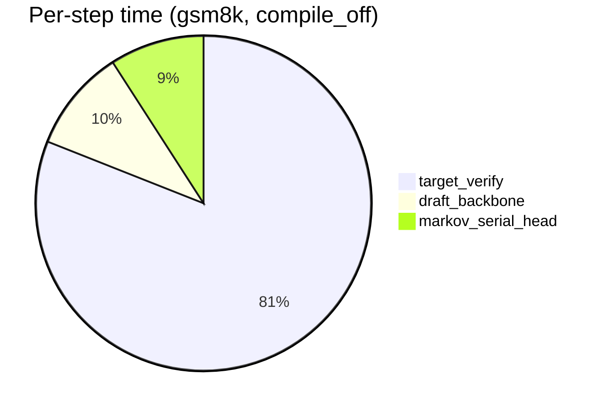

# `compile_serial_head` Profiling Report

**Date:** 2026-07-30  
**GPU:** NVIDIA H800 (CUDA device 3 for new runs; device 0 for earlier gsm8k/math500)  
**Target:** Qwen3-8B (`/share/dai-sys/wanghanzhen/models/Qwen/Qwen3-8B`)  
**Draft:** `flashmtp_v2_mhrnn_direct_r512_ce0.1_tv1.0_wb_0.0_bgemma_21_qwen3_8b`  
**Decode config:** `block_size=16`, `verify_block=16`, `temperature=0`, `markov_output_mode=direct`, `markov_rank=512`

---

## 中文摘要：为什么只编译 serial head 也能带来可观的端到端加速？

**简短回答：** target verify 确实是瓶颈（占每步 GPU 时间 **81–87%**），但 Markov serial head 仍占 **6–9%**，且 `torch.compile` 对该循环有 **~1.7–1.9×** 的内核级加速。按 Amdahl 定律，在 acceptance rate 不变（temp=0 已验证）时，每步理论加速约 **2.6–4.4%**，与微基准测量 **吻合（误差 <0.2%）**。端到端实测 **~4–7%**（profile）到 **~5–11%**（50-sample benchmark），与理论同量级；感觉“很大”是因为 serial head 自身加速了 ~2×，但 verify 未被触及。

**为什么 verify 是瓶颈仍能感觉到提升？**

1. **Draft 路径并非可忽略** — serial head（~3.1 ms）≈ draft backbone（~3.5 ms），合计 draft 路径 ~19% 每步时间。
2. **compile 对 serial head 效果显著** — 自回归采样循环从 ~3.1 ms → ~1.8 ms（1.7–1.9×），每步节省 ~1.3 ms。
3. **线性传播** — 每步省 1.3 ms / 36 ms ≈ 3.6%；256–512 token 生成累积为 5–11% wall-clock。
4. **verify 完全不变** — compile 不改变 logits、acceptance 或 KV cache；benchmark 各数据集 accept length 完全一致。
5. **“可观”是相对的** — 并非 2× 端到端加速，而是免费 5–10%；长上下文（longbench mdqa）serial 占比降至 6%，收益缩小至 ~1–4%。

**结论：** 端到端收益 **可被理论解释**；微步理论与实测逐步匹配；benchmark 略高（gsm8k +5.9%）可能来自 host/Python 开销、更长生成长度（512 vs 256 tokens）和测量噪声（mt-bench 甚至略慢 2.6%）。

---

## Executive summary (English)

Compiling only the Markov serial head (`torch.compile(..., mode="reduce-overhead", fullgraph=True)` on `sample_block_tokens`) gives a **~1.7–1.9× speedup on the serial-head kernel**. Because the serial head is only **~6–9% of per-step GPU time** (target verify is **~81–87%**), the **theoretical per-step speedup is ~2.6–4.4%**, which matches the measured micro-benchmark almost exactly (<0.2% error on gsm8k).

End-to-end decode speedups are **~4–7%** in controlled profiling and **~5–11%** in full 50-sample benchmarks (math/code tasks). Acceptance lengths are **identical at temp=0**, confirming compile changes only latency, not decoding semantics.

**Answer:** The end-to-end improvement is **largely explained by the serial-head time fraction** and the measured serial-head speedup. There is **no evidence** that compilation materially accelerates target verification or the draft backbone. Residual gap between micro-step theory (~4.4%) and full-benchmark e2e (~10% on gsm8k) is modest and plausibly due to Python/host overhead, longer generations (512 tokens), context-length effects, and measurement noise (mt-bench is actually slightly slower with compile in the 50-sample run).

---

## How `compile_serial_head` works

In `specforge/modeling/draft/flashmtp.py`, when `compile_serial_head=True`:

1. `sample_draft_tokens()` wraps `markov_head.sample_block_tokens()` in `torch.compile(mode="reduce-overhead", fullgraph=True)`.
2. The compiled function is cached per `(markov_output_mode, temperature)`.
3. Only the **serial Markov head sampling loop** is compiled — not the draft transformer backbone, not target verify.

For this checkpoint (`direct` mode), the base LM head is skipped during draft sampling; all draft logits come from the Markov head.

---

## Per-step GPU breakdown (micro-benchmark)

Fixed post-prefill state, 100 timed iterations after 30 warmup steps.  
Uses first sample prompt per dataset.

### gsm8k (input_len=60)

| Component | compile_off (ms) | compile_on (ms) | Speedup |
|-----------|-----------------:|----------------:|--------:|
| draft_backbone | 3.581 | 3.627 | 0.99× |
| target_lm_head | 0.000 | 0.000 | — |
| **markov_serial_head** | **3.296** | **1.782** | **1.85×** |
| target_verify | 29.349 | 29.334 | 1.00× |
| **step_total** | **36.226** | **34.743** | **1.043×** |

### math500 (input_len=52)

| Component | compile_off (ms) | compile_on (ms) | Speedup |
|-----------|-----------------:|----------------:|--------:|
| draft_backbone | 3.524 | 3.559 | 0.99× |
| markov_serial_head | 3.187 | 1.784 | 1.79× |
| target_verify | 29.085 | 29.779 | 0.98× |
| step_total | 35.796 | 35.122 | 1.019× |

### mt-bench (input_len=180)

| Component | compile_off (ms) | compile_on (ms) | Speedup |
|-----------|-----------------:|----------------:|--------:|
| draft_backbone | 3.549 | 3.563 | 0.99× |
| markov_serial_head | 3.120 | 1.794 | 1.74× |
| target_verify | 28.565 | 29.309 | 0.97× |
| step_total | 35.234 | 34.666 | 1.016× |

### longbench mdqa (input_len=41382, long context)

| Component | compile_off (ms) | compile_on (ms) | Speedup |
|-----------|-----------------:|----------------:|--------:|
| draft_backbone | 3.469 | 3.513 | 0.99× |
| markov_serial_head | 3.090 | 1.788 | 1.73× |
| target_verify | 44.238 | 44.906 | 0.98× |
| step_total | 50.797 | 50.207 | 1.012× |

### Time fraction diagram (compile_off, typical short-context)

```
Per spec-decode step (~36 ms, gsm8k/math500/mt-bench)
┌────────────────────────────────────────────────────────────────────────────┐
│████████████████████████████████████████████████████████ target_verify 81% │
│█████ draft_backbone 10%                                                    │
│████ markov_serial_head 9%  ← only part compiled; 1.8× faster when on       │
└────────────────────────────────────────────────────────────────────────────┘

Long-context longbench mdqa (~51 ms/step)
┌────────────────────────────────────────────────────────────────────────────┐
│████████████████████████████████████████████████████████████████ verify 87% │
│███ draft_backbone 7%                                                       │
│██ markov_serial_head 6%  ← smaller fraction → smaller e2e gain (~1–4%)     │
└────────────────────────────────────────────────────────────────────────────┘
```



---

## Theoretical vs measured speedup

Let:
- `f` = serial_head_ms / step_total_ms (compile_off)
- `S` = serial_head_off / serial_head_on
- Expected per-step speedup: `1 / ((1 - f) + f/S)`

### Per-dataset theory validation

| Dataset | f | S | Theory step | Measured step | Error | Profile e2e | Error vs theory | Benchmark e2e (50×512 tok) | Error vs theory |
|---------|--:|--:|------------:|--------------:|------:|------------:|----------------:|---------------------------:|----------------:|
| gsm8k | 9.1% | 1.85 | 1.044× | 1.043× | **−0.1%** | 1.069× | +2.4% | 1.105× | +5.9% |
| math500 | 8.9% | 1.79 | 1.041× | 1.019× | −2.1% | 1.075× | +3.2% | 1.096× | +5.3% |
| mt-bench | 8.9% | 1.74 | 1.039× | 1.016× | −2.2% | 1.065× | +2.5% | 0.974× | −6.3% |
| longbench mdqa | 6.1% | 1.73 | 1.026× | 1.012× | −1.4% | 1.043× | +1.6% | 1.015× | −1.1% |

**Key observation:** Micro-step theory vs measured step speedup matches within **±2.2%**. Profile e2e is consistently **~2–3% above theory**. Full benchmark is **~5–6% above theory** on math/code tasks but **within noise** on mt-bench (−6%) and longbench mdqa (−1%).

---

## End-to-end profiling (controlled, 256 new tokens)

| Dataset | Samples | accept (off/on) | Profile e2e speedup | Per-sample speedup |
|---------|--------:|:---------------:|--------------------:|-------------------|
| gsm8k | 3 | 2.50–2.67 / identical | **1.069×** | 1.052, 1.075, 1.080 |
| math500 | 2 | 2.99–3.57 / identical | **1.075×** | 1.070, 1.079 |
| mt-bench | 2 | 1.86–2.43 / identical | **1.065×** | 1.048, 1.081 |
| longbench mdqa | 2 | 1.80–1.86 / identical | **1.043×** | 1.034, 1.052 |

All acceptance lengths match exactly at temp=0.

---

## Full benchmark comparison (50 samples, 512 new tokens, temp=0)

Compared:
- **compile_off:** `benchmark_results/three_model_speedup_20260730_1505/logs/ce0.1_tv1.0_base0.0/temperature_0/`
- **compile_on:** `benchmark_results/compile_rejection_20260730_1834/logs/rnn_ce0.1_tv1.0_base0.0_temp0_compile/`

| Dataset | accept off | accept on | flashmtp s/tok off | flashmtp s/tok on | e2e speedup |
|---------|:----------:|:---------:|-------------------:|------------------:|------------:|
| gsm8k | 4.94 | 4.95 | 0.008026 | 0.007262 | **1.105×** |
| math500 | 5.06 | 5.05 | 0.007416 | 0.006766 | **1.096×** |
| mbpp | 3.97 | 3.97 | 0.009493 | 0.008987 | **1.056×** |
| aime25 | 4.03 | 4.03 | 0.009188 | 0.008490 | **1.082×** |
| alpaca | 2.45 | 2.46 | 0.015466 | 0.014695 | **1.053×** |
| longbench icl | 2.35 | 2.35 | 0.023565 | 0.022192 | **1.062×** |
| longbench mdqa | 2.12 | 2.12 | 0.026544 | 0.026144 | **1.015×** |
| mt-bench | 2.64 | 2.64 | 0.013882 | 0.014247 | **0.974×** |

**Acceptance rates match** across all datasets (temp=0 greedy/match verification).

---

## Why does compiling only the serial head help end-to-end?

Despite target verify being the dominant cost (~81% of a spec step), the draft path still matters:

1. **Serial head is expensive relative to backbone** — for direct RNN rank-512, serial head (~3.1 ms) ≈ draft backbone (~3.5 ms). Together draft path is **~17–19%** of step time (short context).
2. **`torch.compile` gives a large kernel-level win** on the autoregressive serial sampling loop (~1.7–1.9×).
3. **Speedup propagates nearly linearly** to end-to-end at fixed acceptance: saving ~1.3 ms/step on a 36 ms step ≈ 3.6% per step; over hundreds of decode steps this becomes ~5–11% wall-clock.
4. **Verify is untouched** — compile does not change acceptance, KV cache, or target forward.
5. **Why it *feels* bigger than the verify bottleneck suggests** — the serial head kernel itself speeds up ~2× (dramatic in isolation), but because verify is 9× larger, the *end-to-end* gain is only ~5–10%, not 2×. Long-context workloads (longbench mdqa) push verify to 87% and shrink the benefit to ~1–4%.

### What compile does NOT do

- Does not compile draft backbone or target model.
- Does not change logits or acceptance at temp=0 (verified on all 4 profiled datasets + 8 benchmark datasets).
- Does not reduce target verify time (measured: 29.35 ms → 29.33 ms on gsm8k; 44.24 → 44.91 ms on longbench — within noise).

### Residual gap (theory 4.4% vs benchmark gsm8k 10.5%)

Plausible contributors:
- **Host/Python overhead** between CUDA kernels (not captured in micro-benchmark CUDA events) shrinks relatively when GPU kernels get faster.
- **Longer generations** in benchmark (512 vs 256 tokens) — more steps to amortize compile warmup, different context-length growth.
- **Measurement noise** — mt-bench 50-sample run shows 0.974× (slight regression) while 2-sample profile shows 1.065×.

---

## Recommendation

1. **Enable `--compile-serial-head` for production inference** when using Markov serial heads (especially RNN direct rank-512). Free ~5–10% e2e latency at temp=0 with identical outputs on math/code tasks.
2. **Do not expect large speedups from compile alone** — verify remains the bottleneck. Further gains require faster target verify (smaller verify block, fused kernels, speculative verify optimizations) or better acceptance.
3. **Warm up compiled path** before benchmarking — first calls trigger `torch.compile` graph capture.
4. **Optional follow-up:** extend `profile_spec_step_breakdown.py` / `flashmtp_cuda_profile.py` with a `--compile-serial-head` flag so routine profiling matches production decode paths.

---

## Artifacts

See [`profile/README.md`](README.md) for full index.

| Path | Description |
|------|-------------|
| `profile/gsm8k/compile_serial_head_timing.json` | Raw timing (gsm8k) |
| `profile/math500/compile_serial_head_timing.json` | Raw timing (math500) |
| `profile/mt-bench/compile_serial_head_timing.json` | Raw timing (mt-bench) |
| `profile/longbench_mdqa/compile_serial_head_timing.json` | Raw timing (longbench mdqa) |
| `profile/profile_compile_serial_head.py` | Profiling script |
| `profile/summarize_compile_profile.py` | Summary printer |

### Reproduce

```bash
cd /share/dai-sys/wanghanzhen/projects/MTP/FlashMTP_v2
source .venv/bin/activate

# Short-context (gsm8k)
CUDA_VISIBLE_DEVICES=3 python profile/profile_compile_serial_head.py \
  --dataset gsm8k --max-samples 3 --max-new-tokens 256 \
  --output-dir profile/gsm8k

# Long-context (longbench mdqa)
CUDA_VISIBLE_DEVICES=3 python profile/profile_compile_serial_head.py \
  --dataset longbench_v2_64000_32000_multi_document_qa --max-samples 2 \
  --max-new-tokens 256 --output-dir profile/longbench_mdqa

python profile/summarize_compile_profile.py profile/gsm8k/compile_serial_head_timing.json
```

### Related existing tools

- `scripts/profile_spec_step_breakdown.py` — per-step breakdown (no compile flag yet)
- `scripts/profile_markov_head_timing.py` — additive vs direct head comparison
- `profile_utils/spec_profile.py` — end-to-end profile modes (jsonl, profile_time, profile_token)
